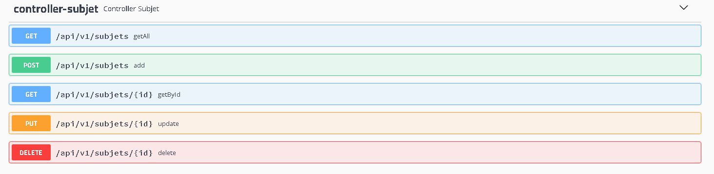
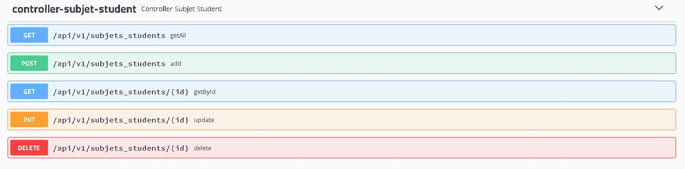

# java-spring-lawyer

This project is a school management system, it has Swagger in order to see all the endpoints and models.
also it is using token authentication or authorization.

## Prerequisites 🔨

1. Install Windows 10
2. Install gradle-6.4.1
3. Install java 1.8.0_201
4. Install Mysql 5

### Optional install mysql db in docker

0. Docker 19.03.8

1. download docker mysql image:

```
docker pull mysql:5
```

2. start container:

```
docker run -d --name mysql -e MYSQL_ROOT_PASSWORD=secret123 -p 3306:3306 mysql:5
```

3. download docker phpmyadmin image:

```
docker pull phpmyadmin/phpmyadmin:4.8
```

4. start container:

```
docker run -d --name myadmin --link mysql:db -p 8080:80 phpmyadmin/phpmyadmin:4.8
container will start in:
http://10.31.35.100:8080/
root, secret123

```

## Deploy 🚀

### Deploy Normal

0. execute all queries from sql folder
1. gradlew build
2. configure build/resources/main/application.properties
3. java -jar build/libs/java-spring-escuela.jar

### Deploy Docker
0. execute all queries from sql folder
1. gradlew build
2. configure build/resources/main/application.properties

```
*server.address=0.0.0.0 # Bind all Docker Container 
*Mandatory: server.address=0.0.0.0
*recomended db host with ip.
```

3. create docker image

```
docker build -t java-spring-escuela:1.0 .
```

4. run container:

```
first time: docker run -d --name java-spring-escuela -p 8080:8080 java-spring-escuela:1.0
then: docker start java-spring-escuela
```

## Diagrams

### Entity relation data base

<p align="center">
  
</p>

### Entity relation - notation chen 

<p align="center">
  
</p>

### Entity relation - notation crows foot

<p align="center">
  
</p>

## Usage

### Default Token: 

```
Bearer eyJhbGciOiJIUzUxMiJ9.eyJqdGkiOiJzb2Z0dGVrSldUIiwic3ViIjoiZHZlcmExIiwiYXV0aG9yaXRpZXMiOlsiUk9MRV9VU0V
SIl0sImlhdCI6MTYwMjEyMTQzMX0.Ee_NdiR3q2HY3nrjP4YY5B5sRs8udEjsZjTDqfT9MUAp8yxWTJ1FYmZZb-F50jeIyEqmQwSXlxejuadeFlI25Q
```

### Swagger Example :

```
http://localhost:8080/swagger-escuela.html
```
#### Swagger:

<p align="center">
  
</p>

#### Controller Course :

<p align="center">
  
</p>

#### Controller Course Student :

<p align="center">
  
</p>

#### Controller Course Subjet :

<p align="center">
  
</p>

#### Controller Login :

<p align="center">
  
</p>

#### Controller Student :

<p align="center">
  
</p>

#### Controller Subjet :

<p align="center">
  
</p>

#### Controller Subjet Student :

<p align="center">
  
</p>

#### Controller User :

<p align="center">
  
</p>

### API:

#### Login:

```
POST localhost:8080/api/v1/login

{
  "username": "admin",
  "password": "admin123"
  "token": "Bearer ..."
}
```
#### Users:

```
GET localhost:8080/api/v1/users
POST localhost:8080/api/v1/users
GET localhost:8080/api/v1/users/{id}
PUT localhost:8080/api/v1/users/{id}
DELETE localhost:8080/api/v1/users/{id}

{
  "id": 1000,
  "username": "admin",
  "password": "admin123",
  "dni": "0000000",
  "name": "Admin",
  "fatherLastName": "Admin",
  "motherLastName": "Admin",
  "birthDate": "1990-01-01",
  "telephone": "76479009",
  "address": "Av. Villazon km-5",
  "email": "Admin@gmail.com",
  "type": "admin",
  "creationDate": "2020-10-16 22:46:43",
  "updateDate": null,
  "createdBy": null,
  "updatedBy": null
}
```

#### Students:

```
GET localhost:8080/api/v1/students
POST localhost:8080/api/v1/students
GET localhost:8080/api/v1/students/{id}
PUT localhost:8080/api/v1/students/{id}
DELETE localhost:8080/api/v1/students/{id}

{
  "id": 1000,
  "dni": "12356",
  "name": "Bart",
  "fatherLastName": "Simpson",
  "motherLastName": "Simpson",
  "birthDate": "1994-10-01",
  "telephone": "77845632",
  "address": "Av. Siempre viva",
  "email": "bart10@gmail.com",
  "yunta": "95-A",
  "grade": "SBTTE",
  "weapon": "CAB",
  "promo": "2019",
  "creationDate": "2020-11-10 21:59:49",
  "updateDate": null,
  "createdBy": "micky",
  "updatedBy": null
}
```

#### Courses:

```
GET localhost:8080/api/v1/courses
POST localhost:8080/api/v1/courses
GET localhost:8080/api/v1/courses/{id}
PUT localhost:8080/api/v1/courses/{id}
DELETE localhost:8080/api/v1/courses/{id}

{
  "id": 1001,
  "name": "Satinador 2016",
  "creationDate": "2020-11-10 21:59:52",
  "updateDate": null,
  "createdBy": "micky",
  "updatedBy": null
}
```

#### Subjets:

```
GET localhost:8080/api/v1/subjets
POST localhost:8080/api/v1/subjets
GET localhost:8080/api/v1/subjets/{id}
PUT localhost:8080/api/v1/subjets/{id}
DELETE localhost:8080/api/v1/subjets/{id}


{
  "id": 1001,
  "name": "DEFENSA PERSONAL",
  "creationDate": "2020-11-10 21:59:52",
  "updateDate": null,
  "createdBy": "micky",
  "updatedBy": null
}
```

#### Courses Students:

```
GET localhost:8080/api/v1/courses-students
POST localhost:8080/api/v1/courses-students
GET localhost:8080/api/v1/courses-students/{id}
PUT localhost:8080/api/v1/courses-students/{id}
DELETE localhost:8080/api/v1/courses-students/{id}

{
  "id": 1000,
  "courseId": 1003,
  "studentId": 1000,
  "creationDate": "2020-11-10 21:59:54",
  "updateDate": null,
  "createdBy": "micky",
  "updatedBy": null
}
```

#### Courses Subjets:

```
GET localhost:8080/api/v1/previous-character
POST localhost:8080/api/v1/previous-character
GET localhost:8080/api/v1/previous-character/{id}
PUT localhost:8080/api/v1/previous-character/{id}
DELETE localhost:8080/api/v1/previous-character/{id}

{
  "id": 1000,
  "courseId": 1003,
  "studentId": 1000,
  "creationDate": "2020-11-10 21:59:54",
  "updateDate": null,
  "createdBy": "micky",
  "updatedBy": null
}
```

#### Subjets Students:

```
GET localhost:8080/api/v1/matter
POST localhost:8080/api/v1/matter
GET localhost:8080/api/v1/matter/{id}
PUT localhost:8080/api/v1/matter/{id}
DELETE localhost:8080/api/v1/matter/{id}

{
  "id": 1000,
  "courseId": 1003,
  "studentId": 1000,
  "creationDate": "2020-11-10 21:59:54",
  "updateDate": null,
  "createdBy": "micky",
  "updatedBy": null
}
```

## Contributing

1. Fork it!
2. Create your feature branch: `git checkout -b feature/1001`
3. Commit your changes: `git commit -m 'feature/1001: Add some feature'`
4. Push to the branch: `git push origin feature/1001`
5. Submit a pull request.

## License

- Free.