# java-spring-escuela

This project is a school management system, it has Swagger in order to see all the endpoints and models.
also it is using token authentication or authorization.

## Prerequisites 🔨

1. Install Windows 10
2. Install gradle-6.4.1
3. Install java 1.8.0_201
4. Install Mysql 5

### Optional install mysql db in docker

0. Docker 19.03.8

1. download docker mysql image:

```
docker pull mysql:5
```

2. start container:

```
docker run -d --name mysql -e MYSQL_ROOT_PASSWORD=secret123 -p 3306:3306 mysql:5
```

3. download docker phpmyadmin image:

```
docker pull phpmyadmin/phpmyadmin:4.8
```

4. start container:

```
docker run -d --name myadmin --link mysql:db -p 8080:80 phpmyadmin/phpmyadmin:4.8
container will start in:
http://10.31.35.100:8080/
root, secret123

```

## Deploy 🚀

### Deploy Normal

0. execute all queries from sql folder
1. gradlew build
2. configure build/resources/main/application.properties
3. java -jar build/libs/java-spring-escuela.jar

### Deploy Docker
0. execute all queries from sql folder
1. gradlew build
2. configure build/resources/main/application.properties

```
*server.address=0.0.0.0 # Bind all Docker Container 
*Mandatory: server.address=0.0.0.0
*recomended db host with ip.
```

3. create docker image

```
docker build -t java-spring-escuela:1.0 .
```

4. run container:

```
first time: docker run -d --name java-spring-escuela -p 8080:8080 java-spring-escuela:1.0
then: docker start java-spring-escuela
```

## Diagrams

### Entity relation data base

<p align="center">
  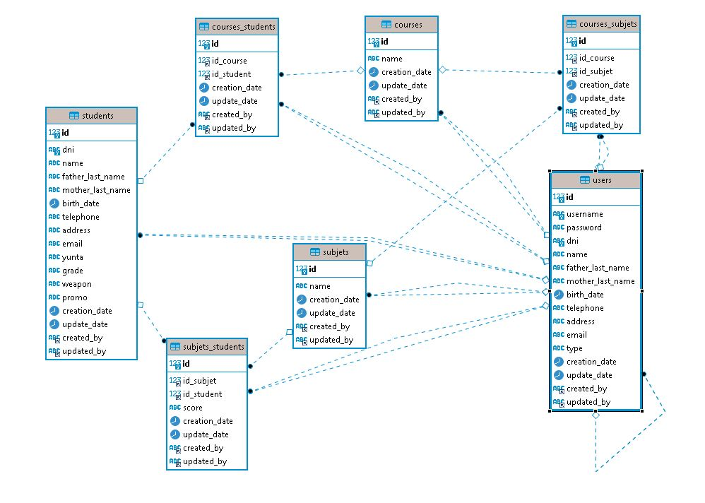
</p>

### Entity relation - notation chen 

<p align="center">
  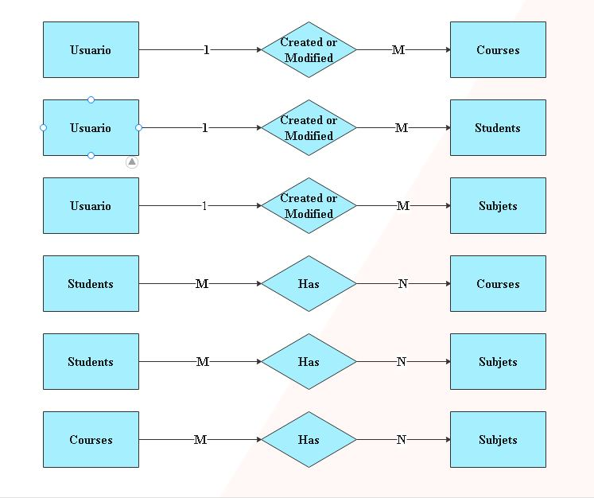
</p>

### Entity relation - notation crows foot

<p align="center">
  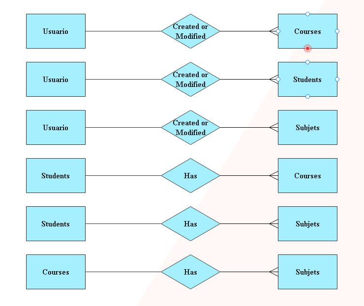
</p>

## Usage

### Default Token: 

```
Bearer eyJhbGciOiJIUzUxMiJ9.eyJqdGkiOiJzb2Z0dGVrSldUIiwic3ViIjoiZHZlcmExIiwiYXV0aG9yaXRpZXMiOlsiUk9MRV9VU0V
SIl0sImlhdCI6MTYwMjEyMTQzMX0.Ee_NdiR3q2HY3nrjP4YY5B5sRs8udEjsZjTDqfT9MUAp8yxWTJ1FYmZZb-F50jeIyEqmQwSXlxejuadeFlI25Q
```

### Swagger Example :

```
http://localhost:8080/swagger-escuela.html
```
#### Swagger:

<p align="center">
  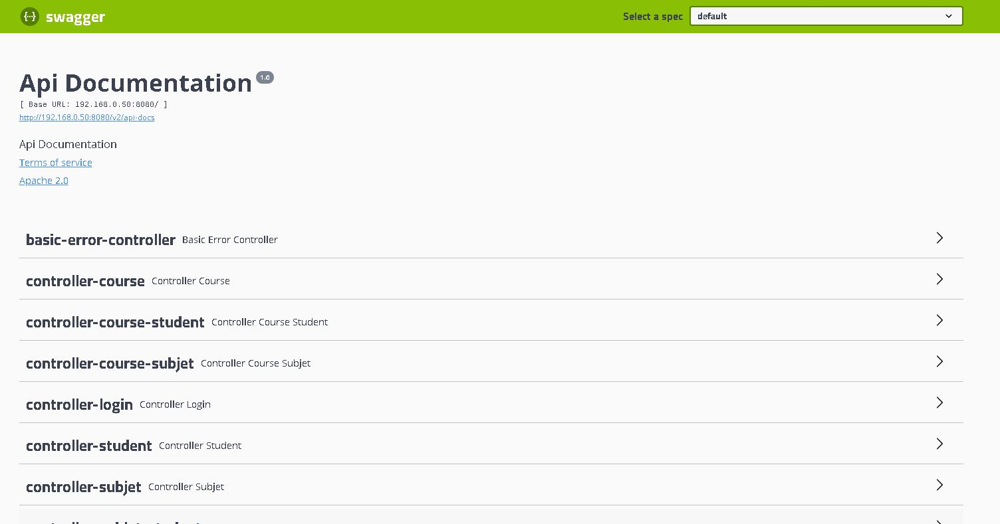
</p>

#### Controller Course :

<p align="center">
  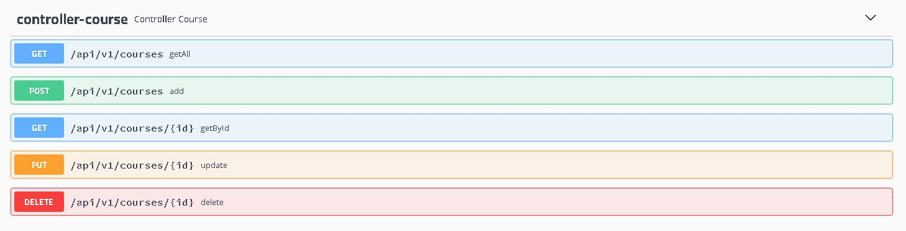
</p>

#### Controller Course Student :

<p align="center">
  
</p>

#### Controller Course Student Join:

<p align="center">
  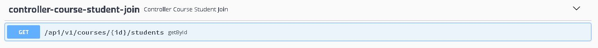
</p>

#### Controller Course Subject :

<p align="center">
  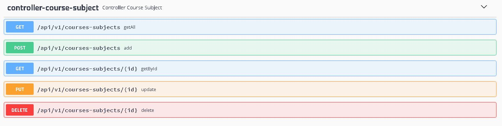
</p>

#### Controller Login :

<p align="center">
  
</p>

#### Controller Student :

<p align="center">
  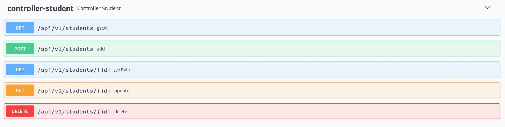
</p>

#### Controller Subject :

<p align="center">
  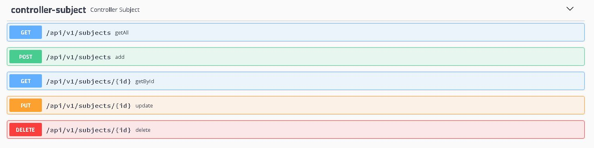
</p>

#### Controller Subject Student :

<p align="center">
  
</p>

#### Controller User :

<p align="center">
  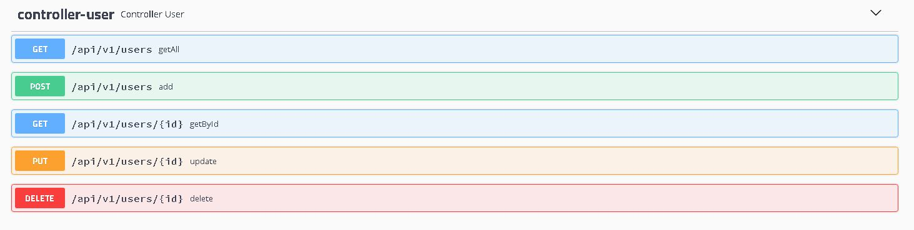
</p>

#### Swagger Models :

<p align="center">
  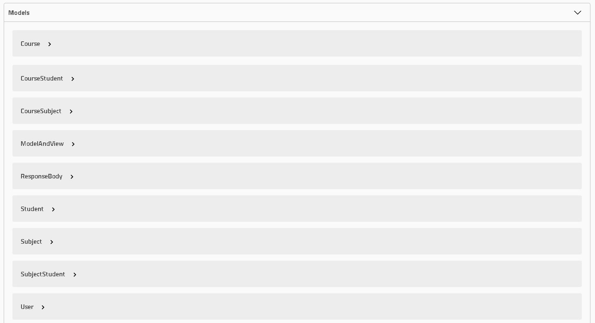
</p>

### API:

#### Login:

```
POST localhost:8080/api/v1/login

{
  "username": "admin",
  "password": "admin123"
  "token": "Bearer ..."
}
```
#### Users:

```
GET localhost:8080/api/v1/users
POST localhost:8080/api/v1/users
GET localhost:8080/api/v1/users/{id}
PUT localhost:8080/api/v1/users/{id}
DELETE localhost:8080/api/v1/users/{id}

{
  "id": 1000,
  "username": "admin",
  "password": "admin123",
  "dni": "0000000",
  "name": "Admin",
  "fatherLastName": "Admin",
  "motherLastName": "Admin",
  "birthDate": "1990-01-01",
  "telephone": "76479009",
  "address": "Av. Villazon km-5",
  "email": "Admin@gmail.com",
  "type": "admin",
  "creationDate": "2020-10-16 22:46:43",
  "updateDate": null,
  "createdBy": null,
  "updatedBy": null
}
```

#### Students:

```
GET localhost:8080/api/v1/students
POST localhost:8080/api/v1/students
GET localhost:8080/api/v1/students/{id}
PUT localhost:8080/api/v1/students/{id}
DELETE localhost:8080/api/v1/students/{id}

{
  "id": 1000,
  "dni": "12356",
  "name": "Bart",
  "fatherLastName": "Simpson",
  "motherLastName": "Simpson",
  "birthDate": "1994-10-01",
  "telephone": "77845632",
  "address": "Av. Siempre viva",
  "email": "bart10@gmail.com",
  "yunta": "95-A",
  "grade": "SBTTE",
  "weapon": "CAB",
  "promo": "2019",
  "creationDate": "2020-11-10 21:59:49",
  "updateDate": null,
  "createdBy": "micky",
  "updatedBy": null
}
```

#### Courses:

```
GET localhost:8080/api/v1/courses
POST localhost:8080/api/v1/courses
GET localhost:8080/api/v1/courses/{id}
PUT localhost:8080/api/v1/courses/{id}
DELETE localhost:8080/api/v1/courses/{id}

{
  "id": 1001,
  "name": "Satinador 2016",
  "creationDate": "2020-11-10 21:59:52",
  "updateDate": null,
  "createdBy": "micky",
  "updatedBy": null
}
```

#### Subjects:

```
GET localhost:8080/api/v1/subjects
POST localhost:8080/api/v1/subjects
GET localhost:8080/api/v1/subjects/{id}
PUT localhost:8080/api/v1/subjects/{id}
DELETE localhost:8080/api/v1/subjects/{id}


{
  "id": 1001,
  "name": "DEFENSA PERSONAL",
  "creationDate": "2020-11-10 21:59:52",
  "updateDate": null,
  "createdBy": "micky",
  "updatedBy": null
}
```

#### Courses Students:

```
GET localhost:8080/api/v1/courses-students
POST localhost:8080/api/v1/courses-students
GET localhost:8080/api/v1/courses-students/{id}
PUT localhost:8080/api/v1/courses-students/{id}
DELETE localhost:8080/api/v1/courses-students/{id}

{
  "id": 1000,
  "courseId": 1003,
  "studentId": 1000,
  "creationDate": "2020-11-10 21:59:54",
  "updateDate": null,
  "createdBy": "micky",
  "updatedBy": null
}
```

#### Courses Subjects:

```
GET localhost:8080/api/v1/courses-subjects
POST localhost:8080/api/v1/courses-subjects
GET localhost:8080/api/v1/courses-subjects/{id}
PUT localhost:8080/api/v1/courses-subjects/{id}
DELETE localhost:8080/api/v1/courses-subjects/{id}

{
  "id": 1000,
  "idCourse": 1003,
  "idSubject": 1000,
  "creationDate": "2020-11-10 21:59:54",
  "updateDate": null,
  "createdBy": "micky",
  "updatedBy": null
}
```

#### Subjects Students:

```
GET localhost:8080/api/v1/subjects-students
POST localhost:8080/api/v1/subjects-students
GET localhost:8080/api/v1/subjects-students/{id}
PUT localhost:8080/api/v1/subjects-students/{id}
DELETE localhost:8080/api/v1/subjects-students/{id}

{
  "id": 1000,
  "idSubject": 1000,
  "idStudent": 1000,
  "score": "60",
  "creationDate": "2020-11-10 22:59:54",
  "updateDate": null,
  "createdBy": "micky",
  "updatedBy": null
}
```

####  Course Student Join:

```
GET localhost:8080/api/v1/courses/{id}/students

{
  "id": 1000,
  "idCourse": 1003,
  "idStudent": 1000,
  "courseName": "Satinador 2018",
  "studentDni": "12356",
  "studentName": "Bart",
  "studentFatherLastName": "Simpson",
  "studentMotherLastName": "Simpson",
  "studentYunta": "95-A",
  "studentGrade": "SBTTE",
  "studentWeapon": "CAB",
  "studentPromo": "2019",
  "creationDate": "2020-11-15 22:59:00",
  "updateDate": null,
  "createdBy": "micky",
  "updatedBy": null
}
```

####  Course Subject Join:

```
GET localhost:8080/api/v1/courses/{id}/subjects

{
  "id": 1000,
  "idCourse": 1003,
  "idSubject": 1000,
  "courseName": "Satinador 2018",
  "subjectName": "ENTRENAMIENTO FISICO",
  "creationDate": "2020-11-16 18:14:39",
  "updateDate": null,
  "createdBy": "micky",
  "updatedBy": null
},
{
  "id": 1001,
  "idCourse": 1003,
  "idSubject": 1001,
  "courseName": "Satinador 2018",
  "subjectName": "DEFENSA PERSONAL",
  "creationDate": "2020-11-16 18:14:39",
  "updateDate": null,
  "createdBy": "micky",
  "updatedBy": null
}
```

####  Student Course Join:

```
GET localhost:8080/api/v1/students/{id}/courses

{
  "id": 1003,
  "idCourse": 1003,
  "idStudent": 1003,
  "courseName": "Satinador 2018",
  "studentDni": "123456",
  "studentName": "Marge",
  "studentFatherLastName": "Simpson",
  "studentMotherLastName": "Simpson",
  "studentYunta": "48-A",
  "studentGrade": "ALF",
  "studentWeapon": "CGON",
  "studentPromo": "2018",
  "creationDate": "2020-11-16 18:14:36",
  "updateDate": null,
  "createdBy": "micky",
  "updatedBy": null
}
```

####  Student Subject Join:

```
GET localhost:8080/api/v1/students/{id}/subjects

{
  "id": 1032,
  "idSubject": 1000,
  "idStudent": 1003,
  "studentDni": "123456",
  "studentName": "Marge",
  "studentFatherLastName": "Simpson",
  "studentMotherLastName": "Simpson",
  "studentYunta": "48-A",
  "studentGrade": "ALF",
  "studentWeapon": "CGON",
  "studentPromo": "2018",
  "subjectName": "ENTRENAMIENTO FISICO",
  "subjectScore": "65",
  "creationDate": "2020-11-16 18:14:42",
  "updateDate": null,
  "createdBy": "micky",
  "updatedBy": null
},
{
  "id": 1033,
  "idSubject": 1001,
  "idStudent": 1003,
  "studentDni": "123456",
  "studentName": "Marge",
  "studentFatherLastName": "Simpson",
  "studentMotherLastName": "Simpson",
  "studentYunta": "48-A",
  "studentGrade": "ALF",
  "studentWeapon": "CGON",
  "studentPromo": "2018",
  "subjectName": "DEFENSA PERSONAL",
  "subjectScore": "79",
  "creationDate": "2020-11-16 18:14:43",
  "updateDate": null,
  "createdBy": "micky",
  "updatedBy": null
}
```

####  Subject Course Join:

```
GET localhost:8080/api/v1/subjects/{id}/courses

{
  "id": 1003,
  "idCourse": 1003,
  "idSubject": 1003,
  "courseName": "Satinador 2018",
  "subjectName": "INSTRUCCION DE TIRO",
  "creationDate": "2020-11-16 18:14:39",
  "updateDate": null,
  "createdBy": "micky",
  "updatedBy": null
},
{
  "id": 1027,
  "idCourse": 1009,
  "idSubject": 1003,
  "courseName": "Condor 2018",
  "subjectName": "INSTRUCCION DE TIRO",
  "creationDate": "2020-11-16 18:14:40",
  "updateDate": null,
  "createdBy": "micky",
  "updatedBy": null
}
```

####  Subject Student Join:

```
GET localhost:8080/api/v1/subjects/{id}/students

{
  "id": 1003,
  "idSubject": 1003,
  "idStudent": 1000,
  "studentDni": "12356",
  "studentName": "Bart",
  "studentFatherLastName": "Simpson",
  "studentMotherLastName": "Simpson",
  "studentYunta": "95-A",
  "studentGrade": "SBTTE",
  "studentWeapon": "CAB",
  "studentPromo": "2019",
  "subjectName": "INSTRUCCION DE TIRO",
  "subjectScore": "79",
  "creationDate": "2020-11-16 18:14:41",
"updateDate": null,
    "createdBy": "micky",
  "updatedBy": null
},
{
  "id": 1019,
  "idSubject": 1003,
  "idStudent": 1001,
  "studentDni": "123478",
  "studentName": "Lisa",
  "studentFatherLastName": "Simpson",
  "studentMotherLastName": "Simpson",
  "studentYunta": "97-A",
  "studentGrade": "SBTTE",
  "studentWeapon": "CAB",
  "studentPromo": "2020",
  "subjectName": "INSTRUCCION DE TIRO",
  "subjectScore": "78",
  "creationDate": "2020-11-16 18:14:42",
  "updateDate": null,
  "createdBy": "micky",
  "updatedBy": null
}
```

####  Course By Id And Student By Id:

```
GET localhost:8080/api/v1/courses/{id}/students/{id}

{
  "id": 1032,
  "idSubject": 1000,
  "idStudent": 1003,
  "studentDni": "123456",
  "studentName": "Marge",
  "studentFatherLastName": "Simpson",
  "studentMotherLastName": "Simpson",
  "studentYunta": "48-A",
  "studentGrade": "ALF",
  "studentWeapon": "CGON",
  "studentPromo": "2018",
  "subjectName": "ENTRENAMIENTO FISICO",
  "subjectScore": "65",
  "creationDate": "2020-11-16 18:14:42",
  "updateDate": null,
  "createdBy": "micky",
  "updatedBy": null
},
{
  "id": 1033,
  "idSubject": 1001,
  "idStudent": 1003,
  "studentDni": "123456",
  "studentName": "Marge",
  "studentFatherLastName": "Simpson",
  "studentMotherLastName": "Simpson",
  "studentYunta": "48-A",
  "studentGrade": "ALF",
  "studentWeapon": "CGON",
  "studentPromo": "2018",
  "subjectName": "DEFENSA PERSONAL",
  "subjectScore": "79",
  "creationDate": "2020-11-16 18:14:43",
  "updateDate": null,
  "createdBy": "micky",
  "updatedBy": null
}
```

####  Student By Id And Course By Id:

```
GET localhost:8080/api/v1/students/{id}/courses/{id}

{
  "id": 1016,
  "idSubject": 1000,
  "idStudent": 1001,
  "studentDni": "123478",
  "studentName": "Lisa",
  "studentFatherLastName": "Simpson",
  "studentMotherLastName": "Simpson",
  "studentYunta": "97-A",
  "studentGrade": "SBTTE",
  "studentWeapon": "CAB",
  "studentPromo": "2020",
  "subjectName": "ENTRENAMIENTO FISICO",
  "subjectScore": "60",
  "creationDate": "2020-11-16 18:14:42",
  "updateDate": null,
  "createdBy": "micky",
  "updatedBy": null
},
{
  "id": 1017,
  "idSubject": 1001,
  "idStudent": 1001,
  "studentDni": "123478",
  "studentName": "Lisa",
  "studentFatherLastName": "Simpson",
  "studentMotherLastName": "Simpson",
  "studentYunta": "97-A",
  "studentGrade": "SBTTE",
  "studentWeapon": "CAB",
  "studentPromo": "2020",
  "subjectName": "DEFENSA PERSONAL",
  "subjectScore": "60",
  "creationDate": "2020-11-16 18:14:42",
  "updateDate": null,
  "createdBy": "micky",
  "updatedBy": null
}
```

####  Course By Id No Students:

```
GET localhost:8080/api/v1/courses/{id}/no-students

{
  "id": 1010,
  "dni": "64915",
  "name": "Ragnar",
  "fatherLastName": "Lothbruk",
  "motherLastName": "Lothbruk",
  "birthDate": "1970-12-03",
  "telephone": "63834717",
  "address": "Av. B. Galindo km4",
  "email": "ragnar10@gmail.com",
  "yunta": "95-B",
  "grade": "ALF",
  "weapon": "CGON",
  "promo": "2020",
  "creationDate": "2020-11-16 18:14:32",
  "updateDate": null,
  "createdBy": "micky",
  "updatedBy": null
},
{
  "id": 1011,
  "dni": "7845961",
  "name": "Lagertha",
  "fatherLastName": "Lothbruk",
  "motherLastName": "Lothbruk",
  "birthDate": "1970-10-06",
  "telephone": "77849563",
  "address": "Av. B. Galindo km9",
  "email": "lager165@gmail.com",
  "yunta": "46-B",
  "grade": "SBTTE",
  "weapon": "CAB",
  "promo": "2020",
  "creationDate": "2020-11-16 18:14:32",
  "updateDate": null,
  "createdBy": "micky",
  "updatedBy": null
}
```

####  Course By Id No Subjects:

```
GET localhost:8080/api/v1/courses/{id}/no-subjects

{
  "id": 1008,
  "name": "CRUCE DE OBSTACULOS",
  "creationDate": "2020-11-16 18:14:35",
  "updateDate": null,
  "createdBy": "micky",
  "updatedBy": null
},
{
  "id": 1009,
  "name": "COMUNICACIONES Y CRIPTOGRAFIA",
  "creationDate": "2020-11-16 18:14:35",
  "updateDate": null,
  "createdBy": "micky",
  "updatedBy": null
},
{
  "id": 1010,
  "name": "DOCTRINA DEL SATINADOR Y PLANEAMIENTO",
  "creationDate": "2020-11-16 18:14:35",
  "updateDate": null,
  "createdBy": "micky",
  "updatedBy": null
}
```

####  Student By Id No Courses:

```
GET localhost:8080/api/v1/students/{id}/no-courses

{
  "id": 1000,
  "name": "Satinador 2015",
  "creationDate": "2020-11-16 18:14:34",
  "updateDate": null,
  "createdBy": "micky",
  "updatedBy": null
},
{
  "id": 1001,
  "name": "Satinador 2016",
  "creationDate": "2020-11-16 18:14:34",
  "updateDate": null,
  "createdBy": "micky",
  "updatedBy": null
},
{
  "id": 1002,
  "name": "Satinador 2017",
  "creationDate": "2020-11-16 18:14:34",
  "updateDate": null,
  "createdBy": "micky",
  "updatedBy": null
}
```

####  Subject By Id No Courses:

```
GET localhost:8080/api/v1/subjects/{id}/no-courses

{
  "id": 1006,
  "name": "Condor 2015",
  "creationDate": "2020-11-16 18:14:34",
  "updateDate": null,
  "createdBy": "micky",
  "updatedBy": null
},
{
  "id": 1007,
  "name": "Condor 2016",
  "creationDate": "2020-11-16 18:14:34",
  "updateDate": null,
  "createdBy": "micky",
  "updatedBy": null
},
{
  "id": 1008,
  "name": "Condor 2017",
  "creationDate": "2020-11-16 18:14:34",
  "updateDate": null,
  "createdBy": "micky",
  "updatedBy": null
}
```

## Contributing

1. Fork it!
2. Create your feature branch: `git checkout -b feature/1001`
3. Commit your changes: `git commit -m 'feature/1001: Add some feature'`
4. Push to the branch: `git push origin feature/1001`
5. Submit a pull request.

## License

- Free.